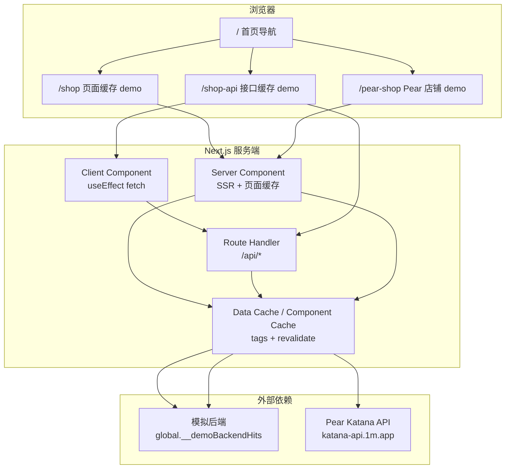

# 项目技术架构与文件设计

> 适用版本：Next.js 16.2.7（App Router） · React 19 · TypeScript 5  
> 项目定位：**Next.js 页面缓存（ISR）与接口缓存（Data Cache）的可运行演示**

---

## 1. 项目目标

本仓库不是业务生产项目，而是一个**缓存策略对照实验场**，用来回答两类问题：

1. **页面缓存**：用户 A 访问后，用户 B 访问同一路径时，能否不再触发 SSR / 上游请求？
2. **接口缓存**：页面必须走客户端请求时，能否让 Next 服务端复用对外部 API 的 `fetch` 结果，降低后端压力？

三个演示页分别展示不同策略；首页 `/` 汇总入口与说明。

---

## 2. 技术栈

| 层级 | 选型 | 说明 |
|------|------|------|
| 框架 | Next.js 16 App Router | `app/` 目录，Server / Client Component 混用 |
| UI | React 19 | 客户端交互组件标记 `"use client"` |
| 语言 | TypeScript 5 | 严格模式，`@/*` 路径别名 |
| 样式 | Tailwind CSS 4 | `app/globals.css` + PostCSS |
| 包管理 | pnpm | `pnpm-workspace.yaml` |
| 部署目标 | Vercel（推荐） | 可用 `x-vercel-cache` 响应头验证缓存命中 |

### 2.1 关键 Next.js 配置

```ts
// next.config.ts
const nextConfig = {
  cacheComponents: true,  // 启用 Component Cache（"use cache" 指令）
};
```

`cacheComponents: true` 与 `app/shop/data.ts` 中的 `"use cache"` + `cacheTag()` / `cacheLife()` 配合，实现**组件级共享缓存**（Next 16 新能力）。

---

## 3. 总体架构



**分层原则**（与 `docs/nextjs-page-cache-vs-api-cache.md` 一致）：

- **公共、跨用户一致的数据** → 走缓存（页面级或 Data Cache）
- **实时 / 用户态数据** → 拆出，用 `no-store` 或客户端请求（本 demo 未实现实时层）
- **发布 / 配置变更** → `revalidateTag()` + `revalidatePath()` 按需失效

---

## 4. 路由与页面设计

### 4.1 路由单一来源：`app/routes.ts`

全站路径集中声明，改路径只改一处；页面、API、组件通过 `@/app/routes` 引用，避免硬编码字符串散落。

```ts
export const routes = {
  home: "/",
  shop: "/shop",           // 页面缓存 demo
  shopApi: "/shop-api",    // 接口缓存 demo
  pearShop: "/pear-shop",  // 真实上游 API + 页面缓存 demo
  api: {
    backend: "/api/backend",
    shopHome: "/api/shop-home",
    publish: "/api/publish",
    pearPageClear: "/api/pear-page-clear",
    pearPublish: "/api/pear-publish",
    pearUser: "/api/pear-user",
  },
} as const;

export const pages = [/* 首页卡片元数据 */] as const;
```

### 4.2 三个演示页对照

| 路径 | 缓存策略 | 取数方式 | 用户 B 的体验 |
|------|----------|----------|---------------|
| `/shop` | **页面缓存** + Component Cache | Server Component 直接调用 `getShopHomeData()` | 命中页面缓存，无客户端 loading，`hits` 不变 |
| `/shop-api` | **接口缓存**（Data Cache） | Client Component `fetch /api/shop-home` | 每次有 loading，但 `hits` 不变（服务端复用缓存） |
| `/pear-shop` | **页面缓存** + `fetch` tag 缓存 | Server Component 调用 `fetchPearUserByVanityUrl()` | 命中页面缓存，`fetchedAt` 不变；清缓存后重新请求上游 |

首页 `app/page.tsx` 读取 `pages` 数组渲染导航卡片。

---

## 5. 目录结构

```
for-next/
├── app/                          # App Router 应用根
│   ├── layout.tsx                # 根布局（metadata、globals.css）
│   ├── page.tsx                  # 首页：ISR 演示导航
│   ├── routes.ts                 # ★ 全站路由常量 + 首页卡片配置
│   ├── globals.css               # Tailwind 全局样式
│   │
│   ├── shop/                     # Demo 1：页面缓存
│   │   ├── page.tsx              # Server Component 页面
│   │   ├── data.ts               # ★ getShopHomeData() — "use cache"
│   │   ├── PublishControls.tsx   # 客户端：模拟发布 → revalidateTag
│   │   └── ShopHomeClient.tsx    # 客户端：供 /shop-api 复用
│   │
│   ├── shop-api/                 # Demo 2：接口缓存
│   │   └── page.tsx              # 复用 shop/ 下的 Client 组件
│   │
│   ├── pear-shop/                # Demo 3：Pear 真实 API + 页面缓存
│   │   ├── page.tsx              # Server Component + 店铺 UI 渲染
│   │   ├── data.ts               # ★ fetchPearUserByVanityUrl() — fetch tags
│   │   ├── PublishControlsPear.tsx
│   │   └── PearShopClient.tsx    # 客户端版（当前未挂载到 page，供对照/扩展）
│   │
│   └── api/                      # Route Handlers
│       ├── backend/route.ts      # 模拟外部后端（hits 计数器）
│       ├── shop-home/route.ts    # 接口缓存入口，复用 getShopHomeData()
│       ├── publish/route.ts      # POST → revalidateTag("demo:shop-home")
│       ├── pear-page-clear/route.ts  # POST → revalidateTag + revalidatePath
│       ├── pear-publish/route.ts     # POST → 仅 revalidateTag
│       └── pear-user/route.ts        # GET → 带 tag 的 fetch Pear API
│
├── docs/                         # 项目文档
│   ├── architecture.md           # 本文档
│   ├── nextjs-page-cache-vs-api-cache.md
│   └── nextjs-page-cache-implementation.md
├── public/                       # 静态资源
├── next.config.ts
├── tsconfig.json                 # paths: "@/*" → "./*"
├── package.json
└── pnpm-workspace.yaml
```

### 5.1 文件命名约定

| 类型 | 命名 | 示例 |
|------|------|------|
| 页面入口 | `page.tsx` | App Router 约定 |
| API 入口 | `route.ts` | 每个 API 一个目录 |
| 服务端取数 | `data.ts` | 缓存逻辑与 fetch 封装 |
| 客户端交互 | `*Client.tsx` | 含 `"use client"` |
| 发布 / 清缓存控件 | `PublishControls*.tsx` | 调用 revalidate 相关 API |

### 5.2 模块职责划分

- **`page.tsx`**：页面编排（Server Component 默认），组合 UI 与数据
- **`data.ts`**：数据获取 + 缓存策略（`"use cache"` 或 `fetch(..., { next: { tags } })`）
- **`*Client.tsx`**：浏览器侧 fetch、loading 状态、按钮交互
- **`app/api/*/route.ts`**：HTTP 边界；触发 `revalidateTag` / `revalidatePath`，或暴露带缓存的 JSON API
- **`routes.ts`**：路径常量，禁止在业务代码中散落 `"/shop"` 等字面量

---

## 6. 缓存实现细节

### 6.1 Demo 1：`/shop` — Component Cache（`"use cache"`）

```
用户请求 /shop
  → page.tsx 调用 getShopHomeData()
  → data.ts："use cache" + cacheTag("demo:shop-home") + cacheLife("default")
  → 首次执行 incDemoBackendHits()，结果写入 Component Cache
  → 后续用户命中缓存，hits 不再递增
```

失效：`POST /api/publish` → `revalidateTag("demo:shop-home", "default")` → 下次访问重新取数。

`globalThis.__demoBackendHits` 模拟“真实后端被调用次数”，仅在缓存 miss 时 +1。

### 6.2 Demo 2：`/shop-api` — Data Cache via Route Handler

```
用户打开 /shop-api
  → ShopHomeClient useEffect → fetch GET /api/shop-home   （浏览器必请求）
  → shop-home/route.ts 调用 getShopHomeData()              （同上 Component Cache）
  → 返回 JSON { hits, backendServedAt, servedBy }
```

关键差异：**每个用户浏览器都会发请求**，但 Next 服务端复用 `getShopHomeData()` 的缓存，上游 hits 不递增。

### 6.3 Demo 3：`/pear-shop` — fetch tag + 页面缓存

```
用户请求 /pear-shop
  → fetchPearUserByVanityUrl("wgbx")
  → fetch(url, { next: { tags: ["demo:pear-shop:wgbx"], revalidate: 900 } })
  → 上游 Pear Katana API（prod → staging 降级）
  → 页面 SSR 渲染店铺 UI；fetchedAt 取响应头 Date
```

失效：`POST /api/pear-page-clear` 同时执行：

1. `revalidateTag(PEAR_DEMO_TAG)` — 清 Data Cache  
2. `revalidatePath("/pear-shop")` — 清页面缓存，下一位用户触发重新 SSR

`pear-shop/page.tsx` 在 build 期若上游失败会**降级展示错误**，不抛异常（避免 Vercel build 失败）。

### 6.4 缓存 tag 一览

| Tag | 用途 | 失效入口 |
|-----|------|----------|
| `demo:shop-home` | 模拟店铺首页数据 | `POST /api/publish` |
| `demo:pear-shop:wgbx` | Pear vanity URL 用户数据 | `POST /api/pear-page-clear` 或 `/api/pear-publish` |

---

## 7. API 设计

| 方法 | 路径 | 作用 |
|------|------|------|
| GET | `/api/backend` | 独立模拟后端，每次调用 hits +1（供理解“无缓存时”的行为） |
| GET | `/api/shop-home` | 返回缓存后的店铺 demo 数据 + `servedBy` 字段 |
| POST | `/api/publish` | `revalidateTag("demo:shop-home")` |
| GET | `/api/pear-user` | 带 tag 缓存的 Pear API 代理（客户端拉取用，`apiHits` 计数） |
| POST | `/api/pear-page-clear` | `revalidateTag` + `revalidatePath(/pear-shop)` |
| POST | `/api/pear-publish` | 仅 `revalidateTag`（不清页面） |

所有 POST 失效接口返回 JSON 含时间戳，便于 UI 展示操作结果。

---

## 8. 组件边界：Server vs Client

```
┌─────────────────────────────────────────────────┐
│  Server Component（默认）                        │
│  - app/shop/page.tsx                            │
│  - app/pear-shop/page.tsx                       │
│  - 可直接 await getShopHomeData() / fetchPear…  │
│  - 不参与 hydration 的静态/SSR 内容              │
└─────────────────────────────────────────────────┘
         │ 嵌入
         ▼
┌─────────────────────────────────────────────────┐
│  Client Component（"use client"）                 │
│  - PublishControls / PublishControlsPear        │
│  - ShopHomeClient / PearShopClient              │
│  - useState、useEffect、router.refresh()        │
└─────────────────────────────────────────────────┘
```

**设计意图**：页面缓存 demo 尽量把取数留在 Server Component；接口缓存 demo 刻意把取数放到 Client，对照“浏览器必请求 vs 后端可复用”的差异。

---

## 9. 本地开发与验证

```bash
pnpm install
pnpm dev          # 开发模式（缓存行为与生产不完全一致）

pnpm build && pnpm start   # ★ 验证 ISR / 缓存请用生产模式
```

### 9.1 验证清单

| 场景 | 操作 | 预期 |
|------|------|------|
| 页面缓存 | A 访问 `/shop`，B 再访问 | B 看到相同 `hits` |
| 发布后刷新 | 点「模拟发布」→ `router.refresh()` | `hits` +1 |
| 接口缓存 | A、B 各访问 `/shop-api` | 各有 loading，但 `hits` 相同 |
| Pear 页面缓存 | A 访问 `/pear-shop`，B 再访问 | `fetchedAt` 不变 |
| Pear 清缓存 | 点「清除页面缓存」→ 下一位用户进入 | `fetchedAt` 更新 |

生产部署后可额外检查响应头 `x-vercel-cache: HIT/MISS` 与 `age`。

---

## 10. 相关文档

| 文档 | 内容 |
|------|------|
| [nextjs-page-cache-vs-api-cache.md](./nextjs-page-cache-vs-api-cache.md) | 页面缓存 vs 接口缓存的技术方案与原则 |
| [nextjs-page-cache-implementation.md](./nextjs-page-cache-implementation.md) | 页面缓存（ISR）落地步骤与踩坑 |
| [AGENTS.md](../AGENTS.md) | Next.js 16 破坏性变更提醒：写代码前查阅 `node_modules/next/dist/docs/` |

---

## 11. 扩展指南

若新增第四个演示或接入真实业务，建议遵循现有模式：

1. 在 `app/routes.ts` 注册路径与 API
2. 新建 `app/<feature>/page.tsx` + `data.ts`（缓存逻辑集中在此）
3. 需要客户端拉取时，抽 `*Client.tsx`，Route Handler 复用 `data.ts`
4. 发布/变更时提供 `POST /api/<feature>-clear`，统一 `revalidateTag` + `revalidatePath`
5. tag 命名：`业务:资源:标识`，如 `shop:${shopId}`，避免随机 tag 导致无法精准失效
